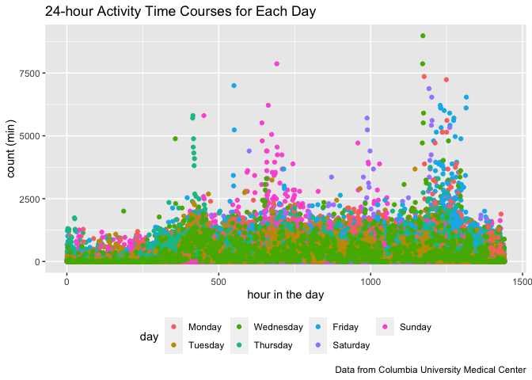
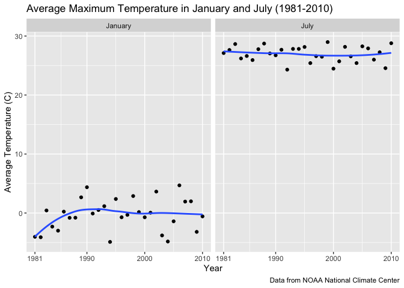
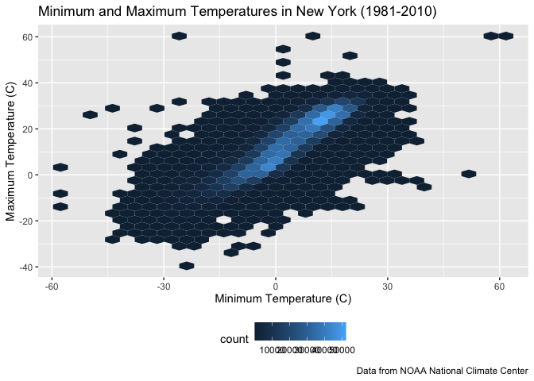
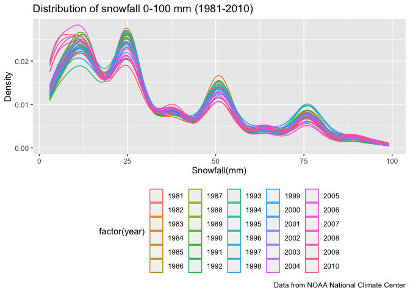
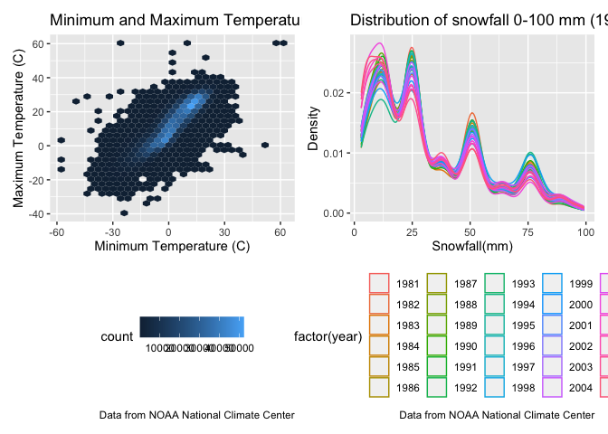

p8105_hw3_st3431
================
2022-10-14

``` r
library(tidyverse)
```

    ## ── Attaching packages ─────────────────────────────────────── tidyverse 1.3.2 ──
    ## ✔ ggplot2 3.3.6      ✔ purrr   0.3.4 
    ## ✔ tibble  3.1.8      ✔ dplyr   1.0.10
    ## ✔ tidyr   1.2.0      ✔ stringr 1.4.1 
    ## ✔ readr   2.1.2      ✔ forcats 0.5.2 
    ## ── Conflicts ────────────────────────────────────────── tidyverse_conflicts() ──
    ## ✖ dplyr::filter() masks stats::filter()
    ## ✖ dplyr::lag()    masks stats::lag()

## Problem 2

``` r
accel_df= read_csv("hw3_data/accel_data.csv") %>% 
  janitor::clean_names()
```

    ## Rows: 35 Columns: 1443
    ## ── Column specification ────────────────────────────────────────────────────────
    ## Delimiter: ","
    ## chr    (1): day
    ## dbl (1442): week, day_id, activity.1, activity.2, activity.3, activity.4, ac...
    ## 
    ## ℹ Use `spec()` to retrieve the full column specification for this data.
    ## ℹ Specify the column types or set `show_col_types = FALSE` to quiet this message.

``` r
accel_tidy= 
  accel_df %>% 
  pivot_longer(
    activity_1:activity_1440, 
    names_to = "minutes",
    values_to= "count"
  ) %>% 
  separate(minutes, into=c("delete", "time")) %>% 
  select(-delete) %>% 
   mutate( 
        across(.col= c(time), as.integer)) %>% 
  mutate(
    weekday_v_weekend = 
      case_when (day== "Monday" ~ "weekday", 
                day=="Tuesday"~ "weekday", 
                day== "Wednesday" ~ "weekday", 
                day=="Thursday" ~ "weekday", 
                day== "Friday" ~ "weekday",
                day== "Saturday" ~ "weekend", 
                day== "Sunday" ~ "weekend"), 
    day= factor(day, levels= c("Monday", "Tuesday", "Wednesday", "Thursday", "Friday", "Saturday", "Sunday")))
     

accel_tidy %>% 
  summarize(
    n_obs= n()
  )
```

    ## # A tibble: 1 × 1
    ##   n_obs
    ##   <int>
    ## 1 50400

``` r
accel_tidy %>% 
  dim()
```

    ## [1] 50400     6

Within the tidied data set the key variables are week, day_id, day,
minutes, count and the weekday v weekend variable. The dimensions of the
tidied set are 50400 rows by 6 columns.

Creating a table showing total activity for each day

``` r
accel_tidy %>% 
  group_by(day) %>% 
  summarize(total_activity= sum(count, na.rm=TRUE)) %>% 
  knitr::kable(caption= "Total Activity by Day")
```

| day       | total_activity |
|:----------|---------------:|
| Monday    |        1858699 |
| Tuesday   |        1799238 |
| Wednesday |        2129772 |
| Thursday  |        2091151 |
| Friday    |        2291711 |
| Saturday  |        1369237 |
| Sunday    |        1919213 |

Total Activity by Day

From this table one trend that can be seen is how Wednesday through
Friday, the later half of the week, has a higher activity count than the
weekend, which Saturday has the lowest activity count.

Creating a single panel plot

``` r
accel_tidy %>% 
  group_by(day, time) %>% 
  ggplot(aes(x=time, y=count, color=day), alpha= 0.5) +
  geom_point() + 
  theme(legend.position= "bottom") +
  labs(
    title= "24-hour Activity Time Courses for Each Day", 
    x= "hour in the day", 
    y= "count (min)",
    caption= "Data from Columbia University Medical Center"
  )
```

<!-- -->

## Problem 3

``` r
library(p8105.datasets)
library(hexbin)
library(patchwork)
data("ny_noaa")
```

Tidying the data

``` r
ny_noaa_tidy= 
  ny_noaa %>% 
  janitor::clean_names() %>% 
  separate(date, c("year", "month", "day"), sep= "-") %>% 
  mutate( month= month.name[as.integer(month)], 
          year= as.integer(year), 
          prcp= as.numeric(prcp)/ 10,
          tmax= as.numeric(tmax)/10, 
          tmin= as.numeric(tmin)/ 10)

ny_noaa_tidy %>% 
  group_by(snow) %>% 
  summarize(n=n()) %>% 
  filter(min_rank(desc(n)) < 2 )
```

    ## # A tibble: 1 × 2
    ##    snow       n
    ##   <int>   <int>
    ## 1     0 2008508

The most commonly observed values for snowfall was 0 inches which makes
sense because the months which it snows are often less than the months
it does not snow (warmer months versus months cold enough to have snow)

Making a two-panel plot showing the average max temp in January and July
across the years

``` r
ny_noaa_tidy %>% 
  select(id, year, month, month, day, tmax, tmin) %>% 
  filter(month == "January" | month == "July") %>% 
  group_by (month, year) %>% 
  summarize(mean_tmax= mean(tmax, na.rm= TRUE)) %>% 
  ggplot(aes(x=year, y=mean_tmax)) + 
  geom_point() + 
  geom_smooth(se=FALSE) +
  facet_grid(~month) + 
  labs(
    title = "Average Maximum Temperature in January and July (1981-2010)", 
    x= "Year", 
    y= "Average Temperature (C)", 
    caption= "Data from NOAA National Climate Center") +
  scale_x_continuous(breaks= c(1981, 1990, 2000, 2010), 
                     labels= c("1981", "1990", "2000", "2010")
  )
```

    ## `summarise()` has grouped output by 'month'. You can override using the
    ## `.groups` argument.
    ## `geom_smooth()` using method = 'loess' and formula 'y ~ x'

<!-- -->

Among this plot, there does not seem to be any identifiable structure to
the average temperature in January or July. There are some outliers,
especially in Jnauary where we see how around 2005 and 1990 the average
temperature was higher than the other means.

Making a two panel plot showing tmin and tmax for the full dataset and a
distribution of the snowfall

1)  plot of tmin and tmax

``` r
min_max_graph= 
  ny_noaa_tidy %>% 
  filter(!is.na(tmin), 
         !is.na(tmax)) %>% 
  ggplot(aes(x=tmin, y=tmax)) + 
  geom_hex() + 
  theme(legend.position = "bottom") +
  labs(
    title= "Minimum and Maximum Temperatures in New York (1981-2010)", 
    x= "Minimum Temperature (C)",
    y= "Maximum Temperature (C)",
    caption= "Data from NOAA National Climate Center"
  )

min_max_graph
```

<!-- -->

2)  plot of the distribution of the snowfall greater than 0 and less
    than 100 by year

``` r
snowfall_graph= 
  ny_noaa_tidy %>% 
  filter(snow > 0, snow < 100) %>%
  ggplot(aes(x = snow, color = factor(year))) +
  geom_density(alpha=0.05) +
  theme(legend.position = "bottom") +
  labs( title= "Distribution of snowfall 0-100 mm (1981-2010)",
    x = "Snowfall(mm)",
    y = "Density",
    caption= "Data from NOAA National Climate Center")

snowfall_graph
```

<!-- -->

``` r
min_max_graph + snowfall_graph
```

<!-- -->
